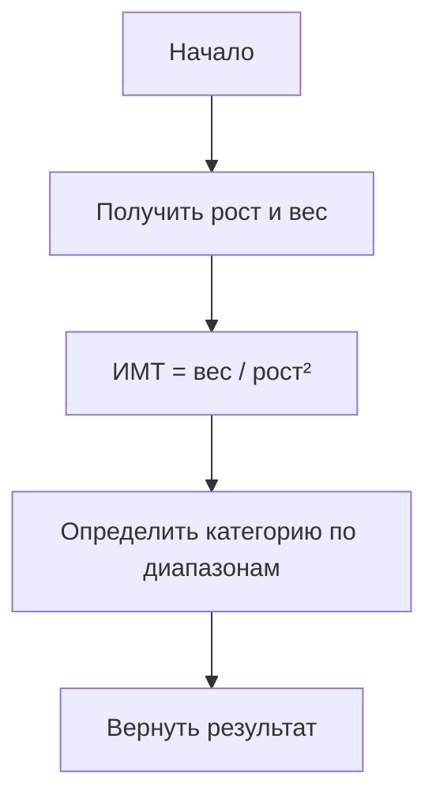

# Калькулятор

Программа предназначена для расчета значений росто-весовых индексов и представления соотношения вычисленного значения с нормативными


## Сценарий использования

**Ввод данных:** Пользователю предоставляются поля для ввода значений – длины тела в см и массы в кг. После их заполнения выполняются необходимые вычисления (по формуле 1). При изменении значений в одном из полей ввода результаты пересчитываются автоматически.

**Оценка результатов**: При запуске программы нормативные значения считываются из файла. Пользователь вводит свои значения длины и массы, выбирает тип индекса и получает результаты на индикаторной шкале.

**Печать результатов:** Пользователь выбирает файл и  сценарий "Ввод данных" полученные результаты расчетов записываются в файл и так до тех пор, пока Пользователь не завершает запись.

## Архитектура приложения


## Реализация
Диаграмма классов приложения:


## Проверка соотвествия
см. класс на Stepik

# Лаб. 1 Калькулятор росто-весовых индексов с индикаторной шкалой

## Этап 1. Разработка MVP

 🎯 Цель этапа

Создать работающий прототип калькулятора росто-весовых индексов, используя данные, хранящиеся непосредственно в коде. Это позволит быстро получить работающее приложение и сфокусироваться на логике расчета, не отвлекаясь на работу с файлами.


**MVP (Minimum Viable Product)** — это минимальная рабочая версия продукта, которая:

- **Решает основную проблему** пользователя
- **Содержит только критически важные функции**
- **Работает и может быть продемонстрирована**
- **Позволяет получить обратную связь**

**В нашем случае MVP должен:**
1. Принимать рост и вес пользователя
2. Рассчитывать индекс массы тела (ИМТ)
3. Определять категорию по нормативным значениям
4. Выводить результат в консоль

**Что НЕ входит в MVP:**
- Графический интерфейс (заменяем консолью)
- Чтение нормативов из файла (данные в коде)
- Индикаторная шкала (заменяем текстовым выводом)
- Сохранение истории измерений

---

## 📖 Теоретическая справка

**Индекс массы тела (ИМТ)** — это величина, позволяющая оценить степень соответствия массы человека и его роста и тем самым косвенно оценить, является ли масса недостаточной, нормальной или избыточной.

**Формула расчета ИМТ:**

$$ИМТ = \frac{вес (кг)}{рост (м)^2}$$

**Классификация ВОЗ:**

| Индекс массы тела | Категория |
|-------------------|-----------|
| < 16.0 | Выраженный дефицит массы |
| 16.0 – 18.5 | Недостаточная масса тела |
| 18.5 – 25.0 | Норма |
| 25.0 – 30.0 | Избыточная масса (предожирение) |
| 30.0 – 35.0 | Ожирение I степени |
| 35.0 – 40.0 | Ожирение II степени |
| > 40.0 | Ожирение III степени |

### LocalDateTime и LocalTime

**LocalTime** — класс для работы со временем (без даты).

```java
import java.time.LocalTime;

LocalTime time = LocalTime.of(14, 30);     // 14:30
LocalTime now = LocalTime.now();           // текущее время
boolean before = time.isBefore(now);       // сравнение
```

**LocalDateTime** — класс для работы с датой и временем.

```java
import java.time.LocalDateTime;

LocalDateTime now = LocalDateTime.now();
LocalDateTime specific = LocalDateTime.of(2025, 9, 15, 14, 30);
int hour = now.getHour();
int minute = now.getMinute();
```

###  Value Objects
**Value Object (Объект-значение)** — это неизменяемый объект, сущность которого определяется его данными, а не идентификатором. Вместо сырого типа `double` мы создаем строгий тип `Height`.

**Архитектурные правила:**
1. **Неизменяемость** — нет сеттеров, класс `final`
2. **Самовалидация** — объект не может существовать в некорректном состоянии
3. **Явные фабричные методы** — вместо конструкторов

---

## 📋 Пошаговая инструкция

### Шаг 1. Создание модели данных (Value Objects)

**Задача:** Создать классы `Height` и `Weight` с валидацией.

**Что нужно сделать:**

1. Создайте класс `Height` в пакете `model`
2. Добавьте поле `double meters` (храним в метрах)
3. Создайте приватный конструктор
4. Создайте фабричные методы `fromCentimeters()` и `fromMeters()`
5. Добавьте валидацию диапазона

**Пример кода:**

```java
package model;

public final class Height {
    private final double meters;

    private Height(double meters) {
        this.meters = meters;
    }

    public static Height fromCentimeters(double cm) {
        if (cm < 40.0 || cm > 280.0) {
            throw new IllegalArgumentException(
                "Ошибка: Рост в см должен быть в диапазоне от 40 до 280");
        }
        return new Height(cm / 100.0);
    }

    public static Height fromMeters(double m) {
        if (m < 0.4 || m > 2.8) {
            throw new IllegalArgumentException(
                "Ошибка: Рост в метрах должен быть в диапазоне от 0.4 до 2.8");
        }
        return new Height(m);
    }

    public double getInMeters() {
        return meters;
    }

    @Override
    public String toString() {
        return String.format("%.0f см", meters * 100);
    }
}
```

**Аналогично создайте класс `Weight`:**

```java
package model;

public final class Weight {
    private final double kilograms;

    private Weight(double kilograms) {
        this.kilograms = kilograms;
    }

    public static Weight fromKilograms(double kg) {
        if (kg < 2.0 || kg > 500.0) {
            throw new IllegalArgumentException(
                "Ошибка: Вес должен быть в диапазоне от 2 до 500 кг");
        }
        return new Weight(kg);
    }

    public double getInKilograms() {
        return kilograms;
    }

    @Override
    public String toString() {
        return String.format("%.1f кг", kilograms);
    }
}
```

**✅ Результат:** Созданы защищенные объекты-значения для роста и веса.

---

### Шаг 2. Создание данных в памяти

**Задача:** Создать класс с жестко заданными нормативными значениями.

**Что нужно сделать:**

1. Создайте класс `BMIRanges` в пакете `model`
2. Создайте метод `getDefaultRanges()`, возвращающий Map с границами категорий
3. Добавьте границы для всех категорий

**Пример кода:**

```java
package model;

import java.util.LinkedHashMap;
import java.util.Map;

public class BMIRanges {
    
    public static Map<BMICategory, double[]> getDefaultRanges() {
        Map<BMICategory, double[]> ranges = new LinkedHashMap<>();
        
        ranges.put(BMICategory.SEVERE_THINNESS, new double[]{0.0, 16.0});
        ranges.put(BMICategory.UNDERWEIGHT, new double[]{16.0, 18.5});
        ranges.put(BMICategory.NORMAL, new double[]{18.5, 25.0});
        ranges.put(BMICategory.OVERWEIGHT, new double[]{25.0, 30.0});
        ranges.put(BMICategory.OBESITY_I, new double[]{30.0, 35.0});
        ranges.put(BMICategory.OBESITY_II, new double[]{35.0, 40.0});
        ranges.put(BMICategory.OBESITY_III, new double[]{40.0, 100.0});
        
        return ranges;
    }
}
```

**Создайте enum `BMICategory`:**

```java
package model;

public enum BMICategory {
    SEVERE_THINNESS("Выраженный дефицит массы", "#3498db"),
    UNDERWEIGHT("Недостаточная масса тела", "#5dade2"),
    NORMAL("Норма", "#2ecc71"),
    OVERWEIGHT("Избыточная масса (предожирение)", "#f39c12"),
    OBESITY_I("Ожирение I степени", "#e67e22"),
    OBESITY_II("Ожирение II степени", "#e74c3c"),
    OBESITY_III("Ожирение III степени", "#c0392b");
    
    private final String description;
    private final String colorCode;
    
    BMICategory(String description, String colorCode) {
        this.description = description;
        this.colorCode = colorCode;
    }
    
    public String getDescription() { return description; }
    public String getColorCode() { return colorCode; }
}
```

**✅ Результат:** Создан источник данных с нормативами.

---

### Шаг 3. Логика расчета и определения категории

**Задача:** Реализовать расчет ИМТ и определение категории.

**Алгоритм расчета:**



**Что нужно сделать:**

1. Создайте класс `BMICalculator` в пакете `model`
2. Реализуйте метод `calculateBMI(Height height, Weight weight)`
3. Реализуйте метод `determineCategory(double bmi)`
4. Добавьте обработку ошибок

**Пример кода:**

```java
package model;

import java.util.Map;

public class BMICalculator {
    private final Map<BMICategory, double[]> ranges;
    
    public BMICalculator() {
        this.ranges = BMIRanges.getDefaultRanges();
    }
    
    public double calculateBMI(Height height, Weight weight) {
        double heightM = height.getInMeters();
        return weight.getInKilograms() / (heightM * heightM);
    }
    
    public BMICategory determineCategory(double bmi) {
        for (Map.Entry<BMICategory, double[]> entry : ranges.entrySet()) {
            double[] range = entry.getValue();
            if (bmi >= range[0] && bmi < range[1]) {
                return entry.getKey();
            }
        }
        return BMICategory.OBESITY_III; // По умолчанию
    }
    
    public BMIResult calculate(Height height, Weight weight) {
        double bmi = calculateBMI(height, weight);
        BMICategory category = determineCategory(bmi);
        return new BMIResult(bmi, category);
    }
}
```

**Создайте класс `BMIResult`:**

```java
package model;

public class BMIResult {
    private final double bmi;
    private final BMICategory category;
    
    public BMIResult(double bmi, BMICategory category) {
        this.bmi = bmi;
        this.category = category;
    }
    
    public double getBmi() { return bmi; }
    public BMICategory getCategory() { return category; }
    
    @Override
    public String toString() {
        return String.format("ИМТ = %.2f (%s)", bmi, category.getDescription());
    }
}
```

**✅ Результат:** Реализована логика расчета и определения категории.

---

### Шаг 4. Консольный вывод

**Задача:** Вывести результат расчета в консоль.

**Что нужно сделать:**

1. Создайте класс `Main` в корневом пакете
2. Получите ввод пользователя через `Scanner`
3. Создайте объекты `Height` и `Weight` с валидацией
4. Выполните расчет через `BMICalculator`
5. Выведите результат с форматированием

**Пример кода:**

```java
package bmi;

import model.*;
import java.util.Scanner;

public class Main {
    public static void main(String[] args) {
        Scanner scanner = new Scanner(System.in);
        BMICalculator calculator = new BMICalculator();
        
        System.out.println("=== Калькулятор ИМТ ===");
        
        try {
            System.out.print("Введите рост (см): ");
            double heightCm = scanner.nextDouble();
            Height height = Height.fromCentimeters(heightCm);
            
            System.out.print("Введите вес (кг): ");
            double weightKg = scanner.nextDouble();
            Weight weight = Weight.fromKilograms(weightKg);
            
            BMIResult result = calculator.calculate(height, weight);
            
            System.out.println("\n=== Результат ===");
            System.out.printf("Рост: %.0f см%n", heightCm);
            System.out.printf("Вес: %.1f кг%n", weightKg);
            System.out.printf("ИМТ: %.2f%n", result.getBmi());
            System.out.println("Категория: " + result.getCategory().getDescription());
            
        } catch (IllegalArgumentException e) {
            System.err.println("Ошибка: " + e.getMessage());
        } catch (Exception e) {
            System.err.println("Ошибка ввода: введите корректное число");
        }
        
        scanner.close();
    }
}
```

**✅ Результат:** Приложение принимает ввод и выводит результат.

---

### Шаг 5. Тестирование MVP

**Тестовые сценарии:**

| № | Рост (см) | Вес (кг) | Ожидаемый ИМТ | Ожидаемая категория |
|---|-----------|----------|---------------|---------------------|
| 1 | 175 | 70 | 22.86 | Норма |
| 2 | 175 | 50 | 16.33 | Недостаточная масса |
| 3 | 175 | 85 | 27.76 | Избыточная масса |
| 4 | 175 | 100 | 32.65 | Ожирение I степени |
| 5 | 175 | 130 | 42.45 | Ожирение III степени |

**Проверка валидации:**

| № | Ввод | Ожидаемый результат |
|---|------|---------------------|
| 1 | Рост 30 см | Ошибка: рост в см должен быть от 40 до 280 |
| 2 | Рост 300 см | Ошибка: рост в см должен быть от 40 до 280 |
| 3 | Вес 1 кг | Ошибка: вес должен быть от 2 до 500 |
| 4 | Вес 600 кг | Ошибка: вес должен быть от 2 до 500 |
| 5 | Буквы | Ошибка ввода: введите корректное число |

---

## Этап 2. Инженерный анализ. Проектирование модели данных

### 🎯 Цель этапа

Выполнить инженерный анализ предметной области «Росто-весовые индексы» и принять обоснованные технические решения по:

- Проектированию модели данных
- Выбору формата хранения нормативов
- Обработке исключительных ситуаций

---

## Анализ

### 1. Обоснование выбора формата хранения данных

| Критерий | CSV | JSON | XML | Properties | Excel |
|----------|-----|------|-----|------------|-------|
| **Читаемость** | ⭐⭐⭐⭐ | ⭐⭐⭐⭐ | ⭐⭐⭐ | ⭐⭐⭐⭐⭐ | ⭐⭐⭐⭐⭐ |
| **Простота парсинга** | ⭐⭐⭐⭐⭐ | ⭐⭐⭐⭐ | ⭐⭐ | ⭐⭐⭐⭐⭐ | ⭐⭐ |
| **Структурированность** | ⭐⭐ | ⭐⭐⭐⭐⭐ | ⭐⭐⭐⭐⭐ | ⭐⭐ | ⭐⭐⭐⭐ |
| **Расширяемость** | ⭐⭐ | ⭐⭐⭐⭐⭐ | ⭐⭐⭐⭐⭐ | ⭐⭐ | ⭐⭐⭐ |
| **Поддержка в Java** | ⭐⭐⭐⭐⭐ | ⭐⭐⭐⭐⭐ | ⭐⭐⭐⭐ | ⭐⭐⭐⭐⭐ | ⭐⭐⭐ |


### 2. Обоснование выбора алгоритма определения категории

| Алгоритм | Сложность | Плюсы | Минусы |
|----------|-----------|-------|--------|
| **Линейный поиск** | O(n) | Простота | Медленно при большом n |
| **Бинарный поиск** | O(log n) | Быстро | Требует сортировки |
| **Switch/case** | O(1) | Быстро | Жестко заданные границы |
| **Map с диапазонами** | O(n) | Гибкость | Требует итерации |


### 3. Обоснование выбора способов обработки ошибок

| Ситуация | Стратегия | Обоснование |
|----------|-----------|-------------|
| Некорректный ввод (буквы) | Исключение + сообщение | Пользователь должен знать об ошибке |
| Рост вне диапазона | Исключение с указанием границ | Защита от некорректных данных |
| Вес вне диапазона | Исключение с указанием границ | Защита от некорректных данных |
| Файл нормативов не найден | Использовать значения по умолчанию | Приложение должно работать |
| Некорректный формат файла | Пропустить некорректные строки + лог | Частичные данные лучше отсутствия |

---

## Указания по проектированию

### 🏗️ Архитектура MVC

**Model (Модель)** Класс `BMICalculator`, который:

- Хранит нормативные значения (границы категорий)
- Содержит логику расчета ИМТ
- Определяет категорию по значению ИМТ
- Не зависит от интерфейса

**View (Представление)** FXML-файл `BMIView.fxml`, содержащий:

- TextField для ввода роста и веса
- Label для отображения значения ИМТ
- Label для отображения категории
- Pane для размещения индикаторной шкалы
- ComboBox для выбора типа индекса
- Button "Сохранить результат"
- Button "Очистить"

**Controller (Контроллер)** Класс `BMIController`, который:

- Реализует `Initializable`
- Связывает View и Model
- Обрабатывает изменение полей ввода
- Обновляет индикаторную шкалу
- Сохраняет результаты в файл

### Рекомендации по реализации

1. Создайте проект для приложения с пакетом `model`

2. Создайте класс `BMIResult` (результат расчета):
   - `double bmi` — значение ИМТ
   - `BMICategory category` — категория
   - `LocalDateTime timestamp` — время расчета

3. Создайте класс `BMICalculator` и напишите метод `BMIResult calculate(Height height, Weight weight)`, который:
   - Рассчитывает ИМТ по формуле
   - Определяет категорию по нормативам
   - Возвращает результат

4. Подумайте о переносе логики в `BMIController`

---

## Варианты индивидуальных заданий

### Варианты индексов для расчета

| № | Индекс | Формула | Описание |
|---|--------|---------|----------|
| 1 | **ИМТ (BMI)** | вес / рост² | Классический индекс массы тела |
| 2 | **Индекс Брока** | рост - 100 | Простой индекс для оценки веса |
| 3 | **Индекс Брейтмана** | рост × 0.7 - 50 | Нормальный вес |
| 4 | **Индекс Ноордена** | рост × 420 / 1000 | Нормальный вес |
| 5 | **Индекс Татоня** | рост - (100 + (рост - 100) / 20) | Нормальный вес |
| 6 | **Индекс Пинье** | рост - (вес + окружность груди) | Оценка телосложения |

### Варианты форматов хранения нормативов

| № | Формат | Стиль заполнения | Пример фрагмента | Сложность |
|---|--------|------------------|------------------|-----------|
| 1 | **CSV** | Компактный | `NORMAL,18.5,25.0` | Низкая |
| 2 | **CSV** | С описанием | `NORMAL,18.5,25.0,Норма` | Низкая |
| 3 | **JSON** | Объектный | `{"normal": {"min": 18.5, "max": 25.0}}` | Средняя |
| 4 | **JSON** | Массивный | `[{"name": "normal", "min": 18.5, "max": 25.0}]` | Средняя |
| 5 | **XML** | Иерархический | `<category name="normal"><min>18.5</min><max>25.0</max></category>` | Высокая |
| 6 | **YAML** | Компактный | `normal: {min: 18.5, max: 25.0}` | Средняя |
| 7 | **Properties** | Ключ-значение | `normal.min=18.5`<br>`normal.max=25.0` | Низкая |
| 8 | **INI** | Секционный | `[NORMAL]`<br>`min=18.5`<br>`max=25.0` | Низкая |

### Легенда сложности

| Сложность | Описание | Требуемые навыки |
|-----------|----------|------------------|
| 🟢 Низкая | Простой построчный парсинг | String.split(), BufferedReader |
| 🟡 Средняя | Структурированные форматы | JSON-simple, Jackson, YAML |
| 🔴 Высокая | Иерархические форматы, валидация | DOM/SAX парсер, JAXB |
| ⚫ Особая | Специфические форматы, сериализация | ObjectOutputStream |

---

## Критерии оценки работы

| Критерий | Баллы | Описание | Уровни выполнения |
|:---------|------:|:---------|:------------------|
| **1. Работоспособность** | 1 | Программа корректно рассчитывает ИМТ и определяет категорию | • **0 баллов**: Программа не запускается<br>• **1 балл**: Работает для базовых случаев<br>• **2 балла**: Корректно работает для всех сценариев |
| **2. Чтение нормативов** | 1 | Корректная загрузка данных из файла заданного формата | • **0 баллов**: Файл не читается<br>• **1 балл**: Чтение работает, но нет обработки ошибок<br>• **2 балла**: Полная обработка исключений |
| **3. Архитектура MVC** | 1 | Реализация GUI согласно требованиям MVC | • **0 баллов**: Интерфейс отсутствует<br>• **1 балл**: Все элементы присутствуют<br>• **2 балла**: Полностью функциональный интерфейс |
| **4. Валидация ввода** | 1 | Реализация Value Objects и обработка ошибок | • **0 баллов**: Нет валидации<br>• **1 балл**: Базовая валидация<br>• **2 балла**: Полная валидация с Value Objects |
| **5. Оформление репо** | 1 | 5 коммитов, gitignore, readme в markdown, лицензия | • **0 баллов**: Нет оформления<br>• **1 балл**: Частичное оформление<br>• **2 балла**: Полное оформление |
| **6. Соблюдение дедлайна** | 1 | Сдача работы в установленный срок | • **0 баллов**: После дедлайна<br>• **1 балл**: Вовремя |

---

## Результат работы

```
# Пользователь запускает приложение
java -jar bmi-calculator.jar

# И получает интерактивный ввод
=== Калькулятор ИМТ ===
Введите рост (см): 175
Введите вес (кг): 82

=== Результат ===
Рост: 175 см
Вес: 82.0 кг
ИМТ: 26.78
Категория: Избыточная масса (предожирение)

# Или при ошибке
=== Калькулятор ИМТ ===
Введите рост (см): 300
Ошибка: Рост в см должен быть в диапазоне от 40 до 280
```

---

## Дополнительные задания

1. **Графическая шкала:** Реализовать визуализацию ИМТ на цветной шкале с использованием JavaFX
2. **История измерений:** Сохранять результаты в файл и отображать в таблице
3. **Несколько индексов:** Реализовать расчет разных индексов (Брока, Брейтмана и др.)
4. **Экспорт отчета:** Сохранять результаты в PDF или Excel
5. **Рекомендации:** Выводить текстовые рекомендации на основе категории

---

## 📚 Рекомендуемая литература

1. [Java LocalDateTime Documentation](https://docs.oracle.com/javase/8/docs/api/java/time/LocalDateTime.html)
2. [Value Object Pattern](https://martinfowler.com/bliki/ValueObject.html)
3. [MVC Pattern](https://martinfowler.com/eaaDev/uiArchs.html)
4. [WHO BMI Classification](https://www.who.int/health-topics/obesity)